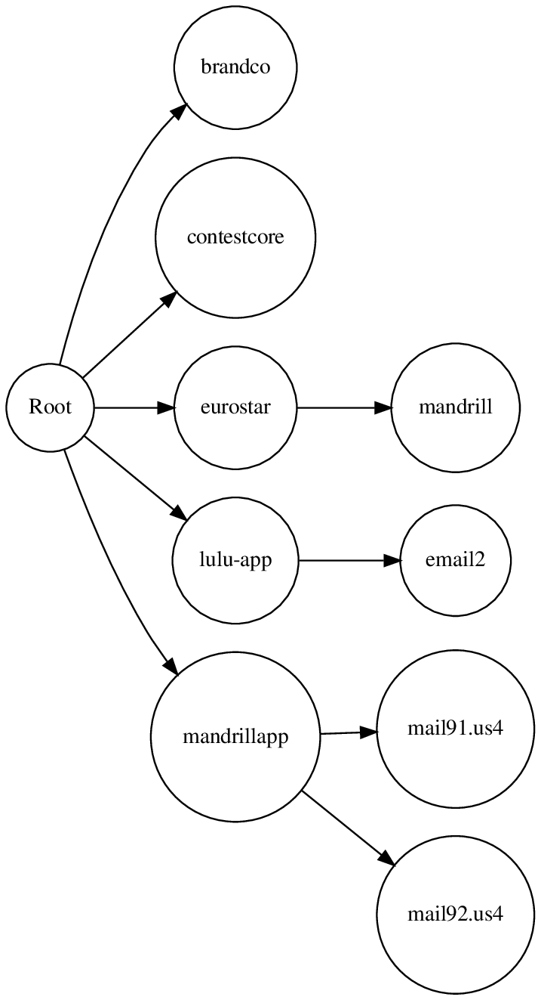

```

 _                _                 _     _____                     
( )     _        ( )               ( )   (_   _)                    
| |    (_)  ___  | |/')    __     _| |     | |   _ __    __     __  
| |  _ | |/' _ `\| , <   /'__`\ /'_` |     | |  ( '__) /'__`\ /'__`\
| |_( )| || ( ) || |\`\ (  ___/( (_| |     | |  | |   (  ___/(  ___/
(____/'(_)(_) (_)(_) (_)`\____)`\__,_)     (_)  (_)   `\____)`\____)

```

Linked Tree is used to build a tree of domains and sub-domains and get output in ASCII , json and image


ASCII:
```
Root
╟── brandco
╟── contestcore
╟── eurostar
║   ╙── mandrill
╟── lulu-app
║   ╙── email2
╙── mandrillapp
    ╟── mail91.us4
    ╙── mail92.us4
```

Json:

```
{"Root": {"children": [{"brandco": {"data": null}}, {"contestcore": {"data": null}}, {"eurostar": {"children": [{"mandrill": {"data": null}}], "data": null}}, {"lulu-app": {"children": [{"email2": {"data": null}}], "data": null}}, {"mandrillapp": {"children": [{"mail91.us4": {"data": null}}, {"mail92.us4": {"data": null}}], "data": null}}], "data": null}}
```

Image:


